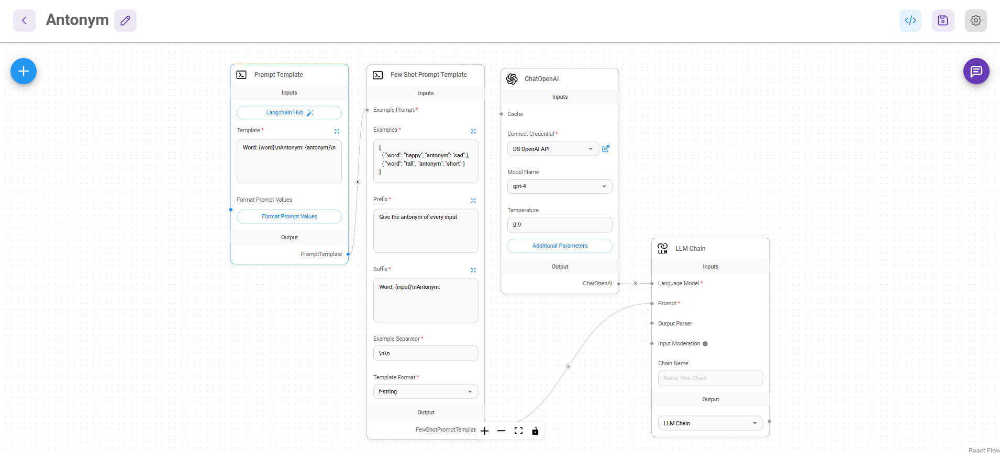

# 반의어 생성 Chain(Antonym)

**주요내용**

**🤖 Few Shot Prompt Template을 사용하여 반의어를 출력하는 Chatflow 생성**

- `Few Shot Prompt Template`를 사용하여 프롬프트 예제를 구축합니다.

## Few Shot Prompt Template
1. `Few Shot Prompt Template`를 프롬프트 예제를 구축합니다.

2. `Prompt Template`를 사용하여 사용자가 입력한 단어의 반의어를 출력하는 템플릿을 생성합니다..

## OpenAI Embeddings / In-Memory Vector Store

`OpenAI`를 사용하여 분할된 문서를 `Vector Store`에 임베딩 처리합니다.

## ChatOpenAI / Conversational Retrieval QA Chain

1. `ChatOpenAI`의 LLM Model을 사용하기 위해 발급받은 OpenAI API Key를 설정한 후 Conversational Retrieval QA Chain 연결합니다.

2. `Conversational Retrieval QA Chain`를 사용하여 대화형 체인을 생성합니다.

## Chatflow 실행

업로드한 문서와 관련된 질문을 하고 그와 관련된 답변을 확인합니다.

