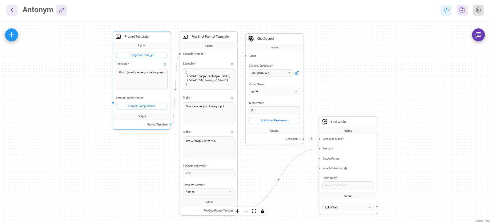

# 반의어 생성 Chain(Antonym)

### **주요내용**

### **✨💡✨ Few Shot Prompt Template을 사용하여 반의어를 출력하는 Chatflow 생성**

- 프롬프트에 예제를 구축할 수 있는`Few Shot Prompt Template`를 사용하여 프롬프트 예제를 구축합니다.

## Few Shot Prompt Template
1. `Few Shot Prompt Template`를 프롬프트 예제를 구축합니다.

2. `Prompt Template`를 사용하여 사용자가 입력한 단어의 반의어를 출력하는 템플릿을 생성합니다.

## LLMChain 생성

앞서 생성한 `Few Shot Prompt Template`과  `ChatOpenAI`의 `Model`을 `LLMChain`에 연결합니다.

## Antonym Chatflow 실행

단어 입력 시 반의어를 출력하는 것을 확인할 수 있습니다.

