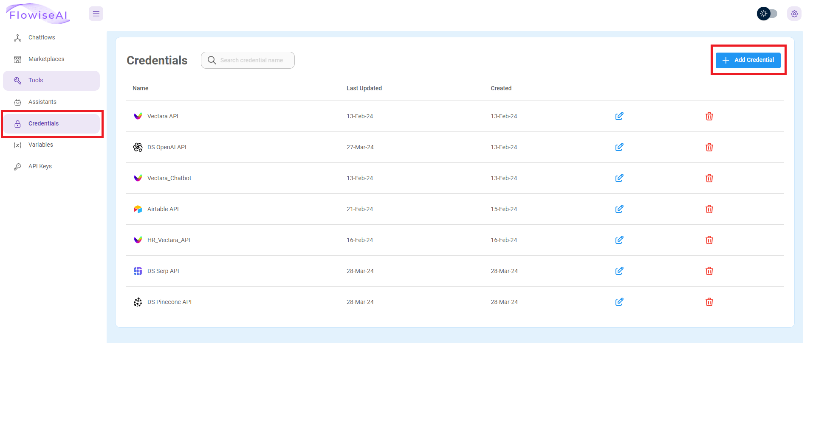

# 🔑 Flowise에 API Key 설정하기

### **💡 각 프로그램별로 API Key 설정하기**

## Flowise API Key 설정하기

1. 왼쪽의 `Credentials`탭을 클릭하여 이동합니다.

2. 이동 후 오른쪽 상단의 **Add credential** 버튼을 클릭합니다.

3. `API Key`를 추가할 프로그램을 검색합니다

