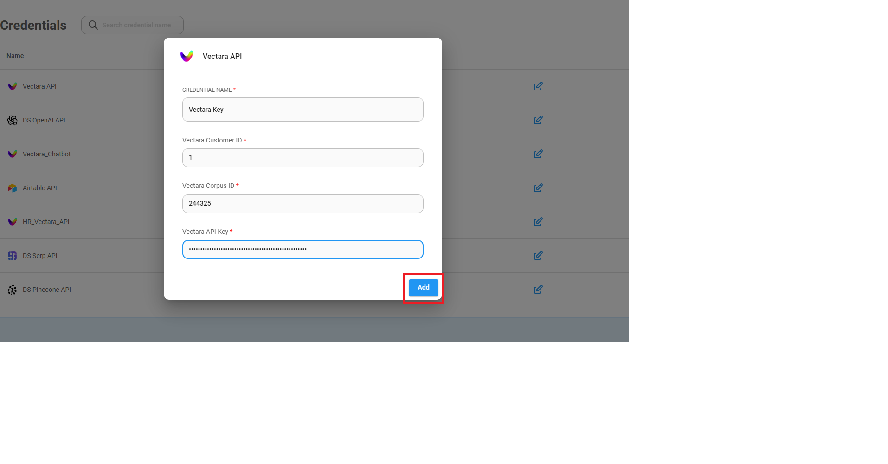

# 🔑 Credential

### **💡 각 프로그램별로 Credential 설정하기**

## Flowise Credential 설정하기

1. 왼쪽의 **Credentials**탭을 클릭하여 이동합니다.

2. 이동 후 오른쪽 상단의 **Add credential** 버튼을 클릭합니다.

3. `API Key`를 추가할 프로그램을 검색합니다

4. 각 프로그램별로 요구하는 값을 입력한 후 **Add** 버튼을 클릭하여 저장합니다. 이제 `Chatflow`에서 설정한 `Credential`을 사용할 수 있습니다.

